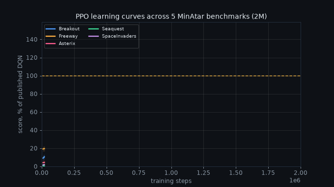
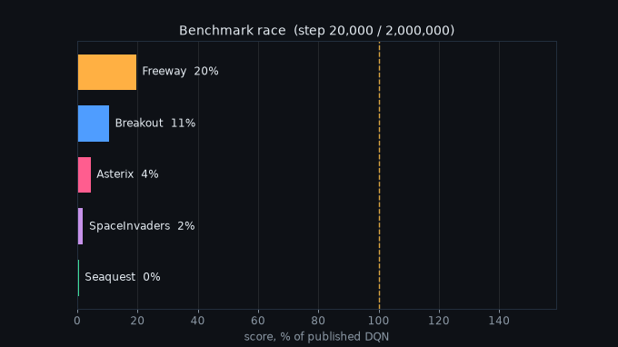
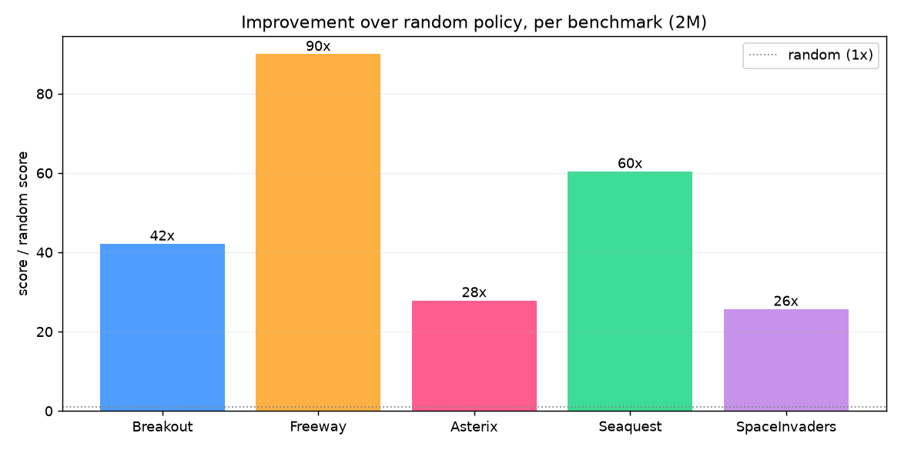
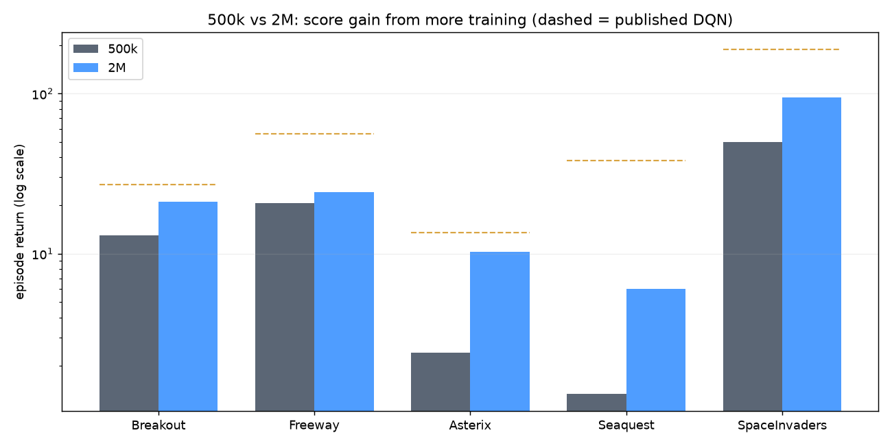

# 🎮 RL_env: One Recipe, Five Public Benchmarks

Build a reinforcement-learning environment, train a **single PPO recipe**, and show it improves score **well above a random policy on 5 public benchmarks** (the MinAtar arcade suite), on CPU. Phase 2 (RL fine-tuning of a small LLM, evaluated on public NLP benchmarks) is planned for GPU.

> **Headline:** one PPO recipe with identical hyperparameters learns all 5 MinAtar games well above random on an Apple M1 (no GPU); at a 2M-step budget it reaches 44% to 78% of the published DQN baselines on four of the five.

## 📈 Results (Phase 1, 2M steps, mean of 3 seeds)

🎬 **Looping 10s animations** (in `report/gifs/`; the live version at `docs/replay.html` auto-plays and loops):





| Game | Random | 500k | PPO (ours, 2M) | Published DQN | % of DQN |
|---|---|---|---|---|---|
| Breakout | 0.5 | 13.0 | **21.1** | 27.1 | 78% |
| Freeway | 0.27 | 20.8 | **24.3** | 55.9 | 44% |
| SpaceInvaders | 3.7 | 49.7 | **95.0** | 188 | 51% |
| Asterix | 0.37 | 2.4 | **10.3** | 13.6 | 76% |
| Seaquest | 0.1 | 1.3 | **6.0** | 38.0 | 16% |

Static comparisons (no animated version):





More plots in `report/plots/`: `B_per_game_curves.png` (per-game vs random/DQN), `C_final_bars.png` (log-scale bars). Interactive animated version: **`docs/replay.html`** (open in a browser). Regenerate the plots with `report/make_plots.py` (see below).

## 🧬 What is an RL environment? (the 6 parts)

The interactive **"Anatomy of the RL environment"** panel in `docs/replay.html` plays a live GridWorld episode and lights up each part as it steps (tabs: GridWorld, MinAtar, LLM env). The same six parts, for the custom env we built (`GridWorld-v0`):

| Part | In GridWorld-v0 |
|---|---|
| 🟦 State (observation) | `Box(4,)` = [agent_row, agent_col, goal_row, goal_col], normalized to [0,1] |
| 🟨 Action space | `Discrete(4)`: up, down, left, right |
| 🟩 Reward function | -0.01 per step (be quick), +1 on reaching the goal |
| 🟪 Transition dynamics | move by the chosen action, clipped at the walls (deterministic) |
| 🟧 Episode | reset to start; ends on the goal (terminated) or the step cap (truncated) |
| 🟥 Task / dataset | one fixed instance: start (0,0), goal (4,4), on a 5x5 grid |

The 5 MinAtar games are the public benchmark suite (10x10xC image state, discrete minimal action set, game-score reward, sticky-action dynamics, 5 task instances). Open `docs/replay.html` and switch tabs to see all three environments mapped live.

## 🗂️ Codebase layout

```text
RL_env/
├── phase1_cpu/              # Phase 1: Gymnasium + Stable-Baselines3 (CPU)
│   ├── config.yaml          # the ONE recipe: hyperparams, seeds, games, baselines
│   ├── requirements.txt
│   ├── envs/
│   │   ├── gridworld_env.py # custom Gymnasium env (GridWorld-v0)
│   │   ├── minatar_cnn.py   # tiny CNN feature extractor for 10x10xC obs
│   │   └── __init__.py      # make_env, config, MinAtar registration + channel-first wrapper
│   ├── train.py             # one PPO recipe, parameterized by --env-id
│   ├── evaluate.py          # greedy eval + random baseline
│   ├── benchmark.py         # loop the recipe over 5 games x seeds -> table + curves
│   ├── run.sh               # gated runbook (setup, checks, smoke, full run, export)
│   └── results/             # per-run logs, models, evaluations.npz, curve.png, summary.md
├── phase2_gpu/              # Phase 2: TRL GRPO + LoRA on an LLM (CUDA GPU)
│   ├── config.yaml          # model, LoRA, GRPO params, benchmarks
│   ├── requirements.txt
│   ├── environment/math_env.py  # verifiable RLVR env: GSM8K + rule-based verifier reward
│   ├── train_grpo.py        # GRPO + LoRA training (--smoke = sanity gate)
│   ├── eval_harness.sh      # lm-eval on 5 NLP benchmarks, base (pre) vs adapter (post)
│   ├── run.sh               # gated: sanity gate -> train -> pre/post eval
│   └── report_phase2.md     # the Phase 2 report (fill after the run)
├── report/
│   ├── export_metrics.py    # results -> tidy metrics.json that feeds the viz
│   ├── make_plots.py        # static eyeball plots -> report/plots/*.png
│   ├── make_gifs.py         # looping 10s animations -> report/gifs/*.gif
│   └── report_phase1.md     # the written Phase 1 report
├── docs/
│   └── replay.html          # interactive animated viz + RL-anatomy (self-contained)
├── plans/                   # v1.md (plan), v1_tracker.md (live status)
└── logs/                    # per-process logs
```

Explore the codebase from the terminal:

```bash
cat phase1_cpu/config.yaml            # the recipe, games, and baselines (single source of truth)
head -60 phase1_cpu/train.py          # the training recipe
head -40 phase1_cpu/envs/gridworld_env.py   # the custom environment
```

## ⚡ Phase 1 setup (CPU, once)

Apple M1 / CPU only, Python 3.13, no GPU needed.

```bash
cd phase1_cpu
python3 -m venv .venv && source .venv/bin/activate
pip install -r requirements.txt
python -c "import stable_baselines3, gymnasium, minatar; print('stack ok')"
```

## ▶️ Phase 1: run the experiments (CPU)

Training commands run from `phase1_cpu/` with the venv active.

```bash
# 0. sanity: build both envs (custom + MinAtar), print obs shapes
python -c "from envs import make_env, minatar_available; print('minatar', minatar_available()); print('grid', make_env('GridWorld-v0',0)().observation_space.shape)"

# 1. train the custom env (proves it learns): return climbs to ~0.93
python train.py --env-id GridWorld-v0 --timesteps 100000

# 2. train one MinAtar game
python train.py --env-id MinAtar/Breakout-v1 --timesteps 500000 --seed 0

# 3. evaluate a saved model vs a random baseline
python evaluate.py --model results/MinAtar_Breakout-v1/seed0/final_model.zip --env-id MinAtar/Breakout-v1 --episodes 30

# 4. the full benchmark: 5 games x 3 seeds -> results.csv + summary.md + per-game curves
python benchmark.py --budget fast --seeds 0 1 2          # 500k per game (fast demo)
python benchmark.py --timesteps 2000000 --seeds 0 1 2    # 2M per game (stronger)

# or the gated runbook (setup -> checks -> smoke -> full run -> export, pauses for review)
./run.sh                 # interactive review gates
./run.sh --yes           # skip the pauses
```

`benchmark.py` flags: `--budget {smoke,fast,full}`, `--timesteps N` (override the budget), `--seeds 0 1 2`, `--suite {auto,minatar,fallback}`, `--episodes N`.

## 📊 Generate the plots and wire the viz

Run from the repo root (these scripts locate paths relative to themselves):

```bash
# the eyeball plots -> report/plots/A..D.png
phase1_cpu/.venv/bin/python report/make_plots.py

# normalize results into the tidy metrics.json the viz reads, then it is injected into replay.html
phase1_cpu/.venv/bin/python report/export_metrics.py --out docs/metrics_phase1.json

# view the interactive replay (the Chrome extension blocks file://, so serve it locally):
cd docs && python3 -m http.server 8000     # then open http://localhost:8000/replay.html
# (or simply double-click docs/replay.html to open it directly in a browser)
```

## 🚀 Phase 2: LLM + GRPO (GPU)

RL-fine-tune Qwen2.5-0.5B with **GRPO + LoRA** on a verifiable **multi-skill** env (GSM8K math + ARC science, rule-based verifier reward, RLVR), then evaluate on 5 public NLP benchmarks. Full run needs a **CUDA GPU (RTX 6000 PRO)**; a tiny smoke runs on the Mac.

```bash
cd phase2_gpu
python -m venv .venv && source .venv/bin/activate
# install the CUDA build of torch first (pytorch.org), then:
pip install -r requirements.txt

./run.sh                       # gated: sanity gate -> full train -> pre/post eval
# or step by step:
python train_grpo.py --smoke   # sanity gate: 50 GRPO steps on 100 problems
python train_grpo.py           # full GRPO run -> LoRA adapter in results/grpo
./eval_harness.sh              # lm-eval base (pre) vs adapter (post) on the 5 tasks
LIMIT=100 ./eval_harness.sh    # quick 100-example slice per task
```

Output: a 5-row `base (pre)` vs `GRPO (post)` table (GSM8K, MMLU, ARC-Challenge, HellaSwag, TruthfulQA) in `phase2_gpu/report_phase2.md`. `report/export_metrics_phase2.py` turns the lm-eval JSONs into `docs/metrics_phase2.json` for the replay viz's Phase 2 tab (`window.DATA_METRICS_P2`).

**Smoke-test on a Mac (no GPU):**

```bash
cd phase2_gpu
python3 -m venv .venv && source .venv/bin/activate
pip install torch transformers trl peft accelerate datasets lm-eval pyyaml   # no vllm
./run_smoke.sh    # tiny GRPO train + lm-eval + export, all on CPU
```

The M1 GPU (MPS) runs the model for inference, but **vLLM is CUDA-only** and **lm-eval segfaults on MPS**, so the smoke uses CPU and the real run needs the GPU box.

## 🧭 Status and roadmap

- ✅ **Phase 1 (CPU): complete.** Custom env + one PPO recipe + 5 MinAtar benchmarks above random, trained to 2M steps (44% to 78% of DQN on four of five). See `phase1_cpu/report_phase1.md`, `plans/v1_tracker.md`, and Figure E for the 500k-vs-2M gain.
- 🔵 **Phase 2 (GPU): code built, not yet trained.** GRPO + LoRA on the verifiable math env, evaluated on 5 NLP benchmarks. Ready to run on the RTX box (see the Phase 2 section above).

## 📁 Where things live

- Plan + live tracker: `plans/v1.md`, `plans/v1_tracker.md`
- Written report: `phase1_cpu/report_phase1.md`
- Per-process logs: `logs/<process>.log`
- Backup of the verified 500k deliverable: `phase1_cpu/results_500k/`
